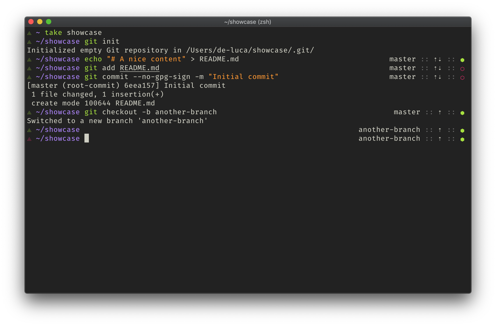

# Trinity

A simple and minimal zsh theme based on an old version of [geometry](https://github.com/geometry-zsh/geometry).

The font used in the screenshot is [Fira Code Retina](https://github.com/tonsky/FiraCode)

## Features

- Prompt symbol changing color depanding on previous command exit status
- Git current branch
- Git dirtyness status
- Display icon if branch is behind or ahead upstream
- Prompt symbol changes when used over SSH
- Display user and host over SSH

## Disclaimer

Trinity is voluntary extremely "feature-lightweight" and is not intended to be fully fledged.

It is based on [a pretty old version of geometry](https://github.com/geometry-zsh/geometry/tree/0d4bbbba861ccdb01cf4027f18facc724b1636f9).

If you are looking for a theme with more customization and plugins I recommend you checkout [geometry](https://github.com/geometry-zsh/geometry).